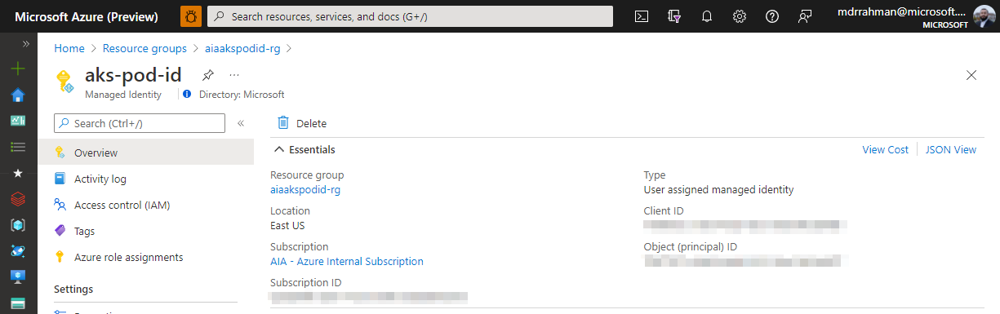
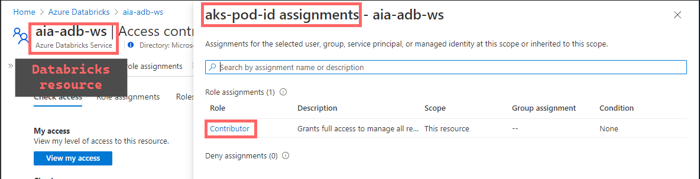
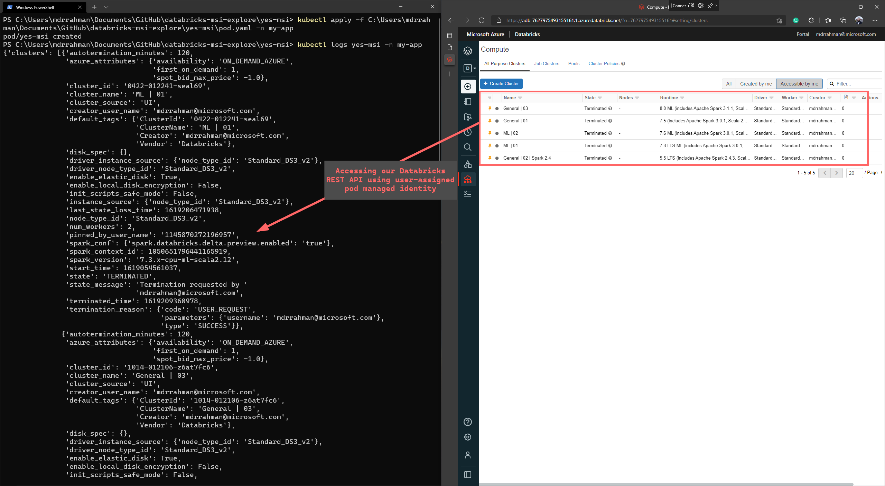

# Accessing Databricks REST API using user-assigned AKS pod identities <!-- omit in toc -->

A simple containerized Python app to query [Databricks REST API](https://docs.microsoft.com/en-us/azure/databricks/dev-tools/api/latest/) using Azure Kubernetes Service [AAD Pod Identity](https://github.com/Azure/aad-pod-identity) - i.e. _without_ using [Service Principals](https://docs.microsoft.com/en-us/azure/databricks/dev-tools/api/latest/aad/service-prin-aad-token) so we don't have to perform credential rotation etc.

Helpful resources used to build this demo:
- [Azure Active Directory Pod Identity for Kubernetes](https://azure.github.io/aad-pod-identity/docs/demo/standard_walkthrough/)
- [naveedzaheer/aks-podid-demo](https://github.com/naveedzaheer/aks-podid-demo/blob/master/aks-podid.sh)
- [Azure AD pod-managed identities in AKS revisited](https://blog.baeke.info/2020/12/09/azure-ad-pod-managed-identities-in-aks-revisited/)
- [Azure Instance Metadata Service (Windows)](https://docs.microsoft.com/en-us/azure/virtual-machines/windows/instance-metadata-service?tabs=windows)

## Table of Contents <!-- omit in toc -->

- [Deploy an AKS cluster with User-assigned managed Identity](#deploy-an-aks-cluster-with-user-assigned-managed-identity)
- [Provide user-assigned managed identity Contributor access on Databricks workspace](#provide-user-assigned-managed-identity-contributor-access-on-databricks-workspace)
- [Deploy container that can query Databricks REST API using user-assigned managed identity](#deploy-container-that-can-query-databricks-rest-api-using-user-assigned-managed-identity)

## Deploy an AKS cluster with User-assigned managed Identity

```bash
# First time enablement takes 10-15 mins for this feature on your subscription
az feature register --name EnablePodIdentityPreview --namespace Microsoft.ContainerService
az feature registration show --name EnablePodIdentityPreview \
                             --provider-namespace Microsoft.ContainerService

az provider register -n Microsoft.ContainerService

# Install the aks-preview extension
az extension add --name aks-preview

# Update the extension to make sure you have the latest version installed
az extension update --name aks-preview
az group create --name nzaplakspodid-rg --location eastus

# Create VNET for AKS
az network vnet create -g nzaplakspodid-rg -n nzaplakspodid-vnet --address-prefixes 192.168.0.0/16 --subnet-name aks-subnet --subnet-prefix 192.168.1.0/24

# Query for VNET and Subnet ID
VNET_ID=$(az network vnet show --resource-group nzaplakspodid-rg --name nzaplakspodid-vnet --query id -o tsv)
SUBNET_ID=$(az network vnet subnet show --resource-group nzaplakspodid-rg --vnet-name nzaplakspodid-vnet --name aks-subnet --query id -o tsv)

# Create AKS cluster with managed identity
az aks create \
    --resource-group nzaplakspodid-rg \
    --name nzaplakspodid-cluster \
    --network-plugin azure \
    --vnet-subnet-id $SUBNET_ID \
    --docker-bridge-address 172.17.0.1/16 \
    --dns-service-ip 10.2.0.10 \
    --service-cidr 10.2.0.0/24 \
    --generate-ssh-keys --enable-managed-identity --enable-pod-identity

# Get kubeconfig
az aks get-credentials --resource-group nzaplakspodid-rg --name nzaplakspodid-cluster

# Create managed identity in Azure
IDENTITY_NAME="aks-pod-id"
az identity create --resource-group nzaplakspodid-rg --name $IDENTITY_NAME
IDENTITY_CLIENT_ID="$(az identity show -g nzaplakspodid-rg -n $IDENTITY_NAME --query clientId -otsv)"
IDENTITY_RESOURCE_ID="$(az identity show -g nzaplakspodid-rg -n $IDENTITY_NAME --query id -otsv)"

# Map to K8s namespace my-app with label app-pod-id
POD_IDENTITY_NAME="app-pod-id"
POD_IDENTITY_NAMESPACE="my-app"
az aks pod-identity add --resource-group nzaplakspodid-rg --cluster-name nzaplakspodid-cluster --namespace $POD_IDENTITY_NAMESPACE  --name $POD_IDENTITY_NAME --identity-resource-id $IDENTITY_RESOURCE_ID

# Where the RG containing the managed identity is
IDENTITY_RESOURCE_GROUP="nzaplakspodid-rg"

az aks show -g nzaplakspodid-rg -n nzaplakspodid-cluster --query "identity"
```
**Note**: if you are running WSL on your Windows machine, you may run into [this error](https://blog.kaniski.eu/2020/12/bad-request-for-url-error-400-in-aks/) due to how Windows handles carriage returns (not related to Azure). Changing the syntax of the above bash script to PowerShell worked for my Windows 10 machine.

## Provide user-assigned managed identity Contributor access on Databricks workspace

This is the Managed identity created above:


Assigned to Contributor on our Databricks Resource:


That is all the pre-requisite required.

## Deploy container that can query Databricks REST API using user-assigned managed identity

Build the container or use [mdrrakiburrahman/databricks-query-yes-ms](https://hub.docker.com/repository/docker/mdrrakiburrahman/databricks-query-yes-msi):

```bash
docker build -t databricks-query-yes-msi .
docker tag databricks-query-yes-msi mdrrakiburrahman/databricks-query-yes-msi
docker push mdrrakiburrahman/databricks-query-yes-msi
```

Deploy container with the 2 environment variables below to point the pod to your Databricks Workspace you assigned the managed identity permissions above:
```yaml
apiVersion: v1
kind: Pod
metadata:
  name: yes-msi
  namespace: my-app
  labels:
    aadpodidbinding: app-pod-id
spec:
  containers:
  - name: yes-msi
    image: mdrrakiburrahman/databricks-query-yes-msi
    imagePullPolicy: Always
    env:
      - name: ADB_ORG_ID
        value: "7627975493155161.1" # This comes from your Workspace URL
      - name: ADB_RESOURCE_ID
        value: "/subscriptions/your-sub-id/resourceGroups/your-databricks-rg/providers/Microsoft.Databricks/workspaces/your-adb-ws"
```

Deploy and observe logs successfully querying Databricks REST API using the pod user-assigned managed identity:
```bash
kubectl apply -f C:\Users\mdrrahman\Documents\GitHub\databricks-msi\yes-msi\pod.yaml -n my-app
kubectl logs yes-msi -n my-app
```

And we see:
